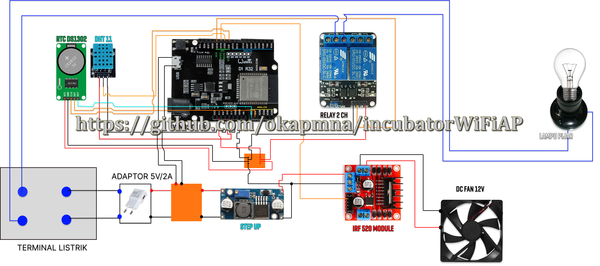

# Smart EGG - Incubator ESP32

Selamat datang di repositori Smart Inkubator. Proyek ini bertujuan untuk memantau dan mengontrol suhu serta kelembaban inkubator penetas telur secara otomatis.

Repositori ini menyediakan **2 Versi** sistem yang dapat Anda pilih sesuai kebutuhan:
1.  **Versi WiFi AP (Access Point):** Kontrol langsung tanpa internet (lokal).
2.  **Versi MQTT (IoT):** Kontrol dan monitoring jarak jauh via internet. Yang dapat di kontrol dengan https://github.com/tobiasdonb/unimon-dashboard
   

<details>
<summary><h2>1. Incubator ESP32 WiFi AP </h2></summary>

### Deskripsi
Versi ini menjadikan ESP32 sebagai Access Point (Hotspot). Pengguna terhubung langsung ke WiFi yang dipancarkan ESP32 untuk membuka halaman web kontrol. Sangat cocok untuk area tanpa koneksi internet stabil.

Antarmuka web memungkinkan pengaturan suhu, kelembaban, lampu, serta timer inkubasi.

### Fitur Utama
* **Monitoring Real-time:** Pembacaan suhu dan kelembaban via DHT11.
* **Kontrol Lampu:** Otomatisasi via Relay.
* **Kontrol Kipas:** Pengaturan kecepatan manual atau otomatis berdasarkan suhu.
* **Timer Inkubasi:** Menghitung hari operasional sejak dimulai.
* **Web Interface:** Dashboard kontrol via browser (tanpa perlu install aplikasi).

### Hardware & Komponen
* ESP32 Development Board
* Sensor Suhu & Kelembaban DHT11
* Modul Relay 1 Channel
* Fan DC 12V
* Motor Driver (untuk kontrol kecepatan fan)
* RTC DS1302 (Modul Jam Real-time)
* Kabel Jumper
* Adaptor 5V & Sumber daya 12V (untuk fan)

### Konfigurasi Pin

| Komponen | Pin ESP32 | Keterangan |
| :--- | :--- | :--- |
| **DHT11** | GPIO 23 | Data Sensor |
| **Relay** | GPIO 18 | Kontrol Lampu |
| **Fan DC** | GPIO 19 | PWM Fan Control |
| **RTC DS1302** | GPIO 4 | DATA |
| **RTC DS1302** | GPIO 5 | CLK |
| **RTC DS1302** | GPIO 2 | RST |

### Cara Penggunaan
1.  Upload kode versi **WiFi AP** ke ESP32.
2.  Nyalakan perangkat.
3.  Hubungkan HP/Laptop ke WiFi dengan kredensial berikut:
    * **SSID:** `NYUDISSS`
    * **Password:** `87654321C`
4.  Buka browser dan akses `index.html` (atau IP address statis jika diatur, biasanya `192.168.4.1`).
5.  Dashboard akan muncul untuk memantau suhu, mengontrol lampu, dan mengatur timer.

### Skematik & Dokumentasi
**Skematik Rangkaian:**
<br>


**Poster & Real Picture:**
<br>

</details>

<details>
<summary><h2>2. Incubator ESP32 MQTT (IoT)</h2></summary>

### Deskripsi
Versi ini menghubungkan ESP32 ke internet melalui WiFi rumah dan mengirimkan data ke MQTT Broker. Versi ini memungkinkan Anda memantau inkubator dari jarak jauh (di luar rumah) menggunakan dashboard IoT.

### Fitur Utama
* **WiFiManager:** Dapat digunakan dimana saja tanpa perlu konfigurasi Wi-Fi di Hardcode
* **Akses Internet:** Monitoring dari mana saja.
* **Pub/Sub MQTT:** Pengiriman data suhu real-time ke broker.
* **Sinkronisasi Status:** Status lampu dan kipas tersinkronisasi dengan dashboard.

### Hardware & Komponen
* *Sama dengan versi WiFi AP (Lihat di atas).*

### Konfigurasi Pin
| Komponen | Pin ESP32 | Keterangan |
| :--- | :--- | :--- |
| **DHT22** | GPIO 18 | Data Sensor (Suhu & Kelembapan) |
| **L298N Motor Driver** | GPIO 19 | FAN Control (IN1) |
| **AOD4148 MOSFET** | GPIO 15 | HEATER Control (Pemanas) |
| **Relay Module** | GPIO 05 | HUMIDIFIER Control (IN1) |

### Cara Penggunaan
1.  Buka file kode versi **MQTT**.
2.  Edit bagian kredensial WiFi dan MQTT Broker:
    ```cpp
    const char* mqtt_server = "your.mqtt.server";
    const int mqtt_port = 8883;
    const char* mqtt_user = "incubator_user";
    const char* mqtt_pass = "incubator_pass";
    ```
3.  Upload ke ESP32.
4.  Gunakan aplikasi Dashboard MQTT (seperti MQTT Dash, IoT MQTT Panel, atau Node-RED) dan subscribe ke topik yang ditentukan.

### Skematik
*(Gunakan skematik yang sama atau tambahkan gambar skematik khusus versi MQTT di sini)*

</details>


## Contributor
- **Oka Pmna** - [@okapmna](https://github.com/okapmna)
- **IDA BAGUS WILLI PARMITA** - [@WILIOP-666](https://github.com/WILIOP-666)
