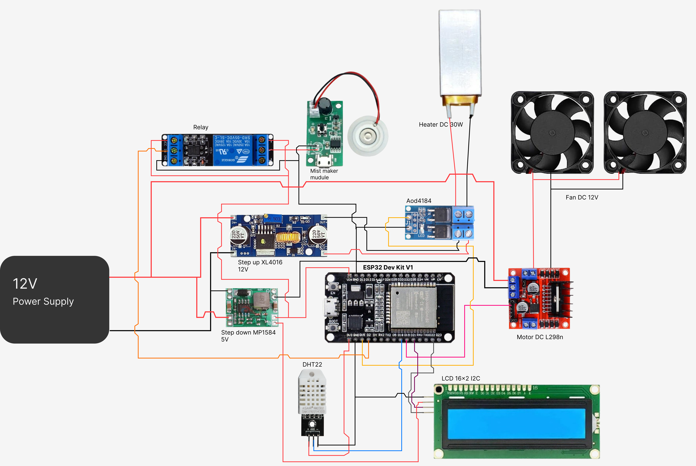
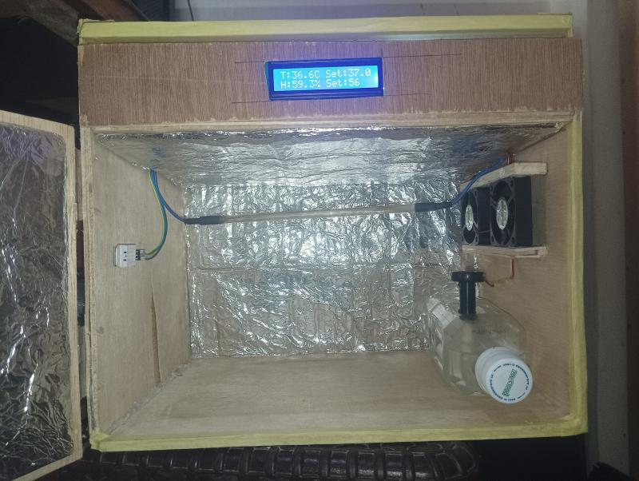
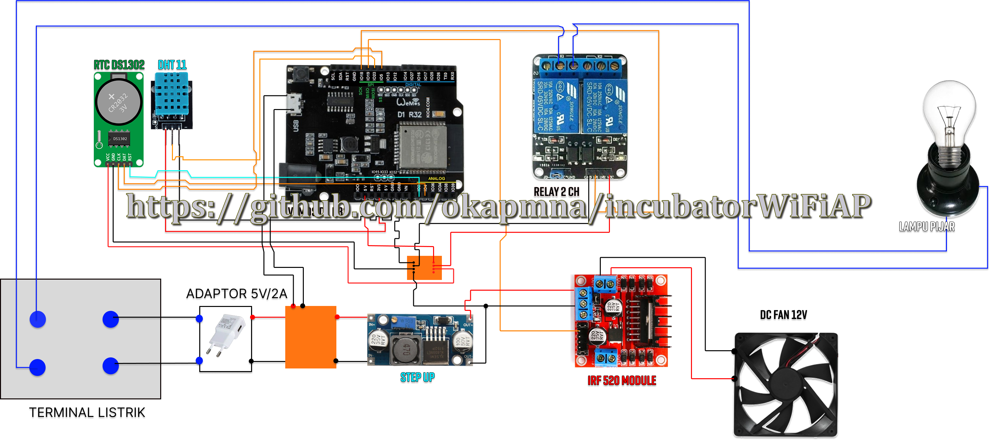

# Smart EGG Incubator ESP32

Welcome to the Smart Incubator repository. This project aims to automatically monitor and control the temperature and humidity of an egg incubator.

This repository provides **2 Versions** of the system that you can choose from according to your needs:
1.  **MQTT (IoT) Version:** Remote control and monitoring via the internet. It can be controlled with universal dashboards such as [Unimon-dashboard](https://github.com/okapmna/unimon-dashboard.git) and Node-RED.
2.  **WiFi AP (Access Point) Version:** Direct control without the internet (local).

   

<details>
<summary><h2>1. Incubator ESP32 MQTT (IoT)</h2></summary>

### Description
This version connects the ESP32 to the internet via your home WiFi and sends data to an MQTT Broker. This allows you to monitor the incubator remotely (outside the house) using an IoT dashboard.

### Key Features
* **WiFiManager:** Can be used anywhere without the need for hardcoded Wi-Fi configurations.
* **Internet Access:** Monitor from anywhere.
* **MQTT Pub/Sub:** Real-time temperature data transmission to the broker.
* **Status Synchronization:** Lamp and fan statuses are synchronized with the dashboard.

### Hardware & Components
* *Same as the WiFi AP version (See below).*

### Pin Configuration
| Component | ESP32 Pin | Description |
| :--- | :--- | :--- |
| **DHT22** | GPIO 18 | Sensor Data (Temperature & Humidity) |
| **L298N Motor Driver** | GPIO 19 | FAN Control (IN1) |
| **AOD4148 MOSFET** | GPIO 15 | HEATER Control |
| **Relay Module** | GPIO 05 | HUMIDIFIER Control (IN1) |

### How to Use
1.  Open the **MQTT** version code file.
2.  Edit the WiFi credentials and MQTT Broker section:
    ```cpp
    const char* mqtt_server = "your.mqtt.server";
    const int mqtt_port = 8883;
    const char* mqtt_user = "incubator_user";
    const char* mqtt_pass = "incubator_pass";
    ```
3.  Upload it to the ESP32.
4.  Use an MQTT Dashboard application (such as MQTT Dash, IoT MQTT Panel, or Node-RED) and subscribe to the specified topics.

### Circuit Schematic and Device Real Picture



</details>

<details>
<summary><h2>2. Incubator ESP32 WiFi AP </h2></summary>

### Description
This version sets the ESP32 as an Access Point (Hotspot). Users connect directly to the WiFi broadcasted by the ESP32 to open the control web page. It is highly suitable for areas without a stable internet connection.

The web interface allows you to adjust the temperature, humidity, lamps, and incubation timer.

### Key Features
* **Real-time Monitoring:** Temperature and humidity readings via DHT11.
* **Lamp Control:** Automation via Relay.
* **Fan Control:** Manual or automatic speed adjustment based on temperature.
* **Incubation Timer:** Counts operational days since starting.
* **Web Interface:** Control dashboard via browser (no app installation required).

### Hardware & Components
* ESP32 Development Board
* DHT11 Temperature & Humidity Sensor
* 1-Channel Relay Module
* 12V DC Fan
* Motor Driver (for fan speed control)
* RTC DS1302 (Real-time Clock Module)
* Jumper Wires
* 5V Adapter & 12V Power Supply (for the fan)

### Pin Configuration

| Component | ESP32 Pin | Description |
| :--- | :--- | :--- |
| **DHT11** | GPIO 23 | Sensor Data |
| **Relay** | GPIO 18 | Lamp Control |
| **DC Fan** | GPIO 19 | PWM Fan Control |
| **RTC DS1302** | GPIO 4 | DATA |
| **RTC DS1302** | GPIO 5 | CLK |
| **RTC DS1302** | GPIO 2 | RST |

### How to Use
1.  Upload the **WiFi AP** version code to the ESP32.
2.  Turn on the device.
3.  Connect your phone/laptop to the WiFi using the following credentials:
    * **SSID:** `NYUDISSS`
    * **Password:** `87654321C`
4.  Open a browser and access `index.html` (or the static IP address if set, usually `192.168.4.1`).
5.  The dashboard will appear, allowing you to monitor the temperature, control the lamp, and set the timer.

### Schematics & Documentation
**Circuit Schematic:**
<br>


**Poster & Real Picture:**
<br>

</details>


## Contributors
- **Oka Pmna** - [@okapmna](https://github.com/okapmna)
- **IDA BAGUS WILLI PARMITA** - [@WILIOP-666](https://github.com/WILIOP-666)
