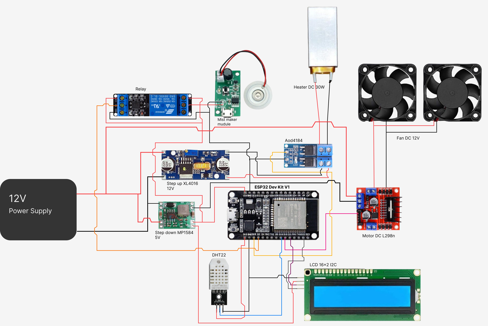
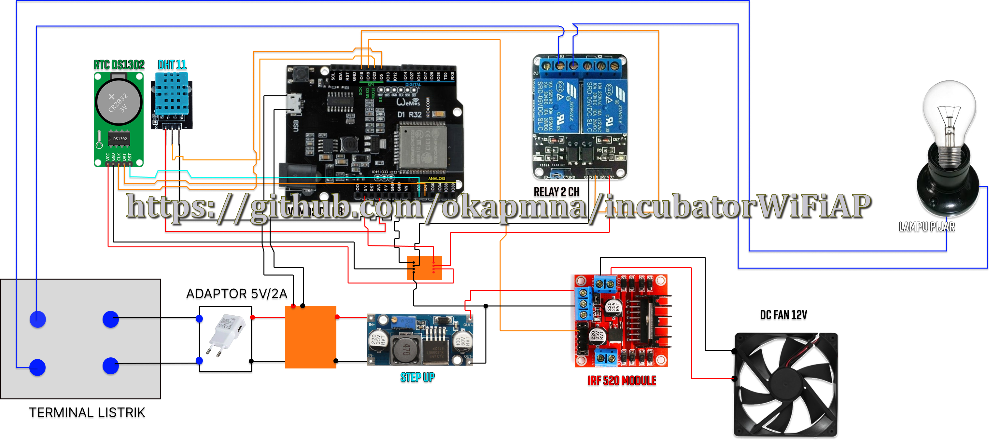
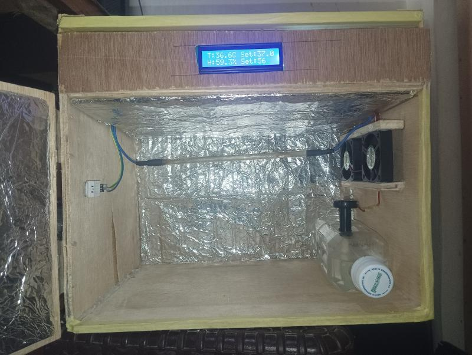

# Smart Egg Incubator ESP32 — MQTT (IoT)

Sistem kontrol inkubator telur otomatis berbasis ESP32 dengan konektivitas MQTT (TLS).
Suhu dan kelembapan dibaca dari sensor SHT30, dikontrol otomatis (pemanas PID, humidifier relay,
kipas PWM, servo pembalik telur), ditampilkan di layar TFT ST7735S 1,8" 128×160 portrait,
dan dikirim ke MQTT broker secara realtime. Monitoring dan kontrol jarak jauh bisa lewat
dashboard seperti [Unimon-dashboard](https://github.com/okapmna/unimon-dashboard.git) atau Node-RED.

Firmware utama: `firmware/incubator_esp32_mqtt/incubator_esp32_mqtt.ino` (satu file + `icons.h` + `secret.h`).

## Fitur Utama

- **WiFiManager non-blocking:** tanpa hardcode SSID/password. Saat boot tanpa WiFi tersimpan,
  buka AP `ESP32_Incubator_AP` untuk input kredensial. Portal timeout 180 detik, auto-reconnect aktif.
- **Dual-core FreeRTOS:** jaringan (WiFi + MQTT + NTP) jalan di Core 0 (`networkTask`),
  UI/menu/sensor/servo jalan di Core 1 (`loop`) sehingga tampilan tidak macet saat TLS handshake.
- **MQTT TLS (port 8883):** publish data sensor tiap 5 detik, subscribe perintah kontrol.
- **Kontrol otomatis:**
  - Pemanas PID (`AutoPID`, KP=15.0, KI=0.5, KD=20.0, BangBang 0,5 °C) + kickstart PWM 120 bila output < 15 dan suhu < target.
  - Humidifier relay dengan histeresis: ON bila `hum <= target - 1%`, OFF bila `hum >= target`.
  - Kipas PWM selalu jalan mengikuti setting (0–100% → 0–255), tetap jalan walau sensor putus.
  - Servo pembalik telur 2 mode: `JADWAL` (balik tiap 1–24 jam, default 3 jam) dan `SWING` (ayun terus 0↔180°).
- **Layar TFT + rotary encoder:** menu navigasi, edit, submenu servo, dan layar konfirmasi. Partial-update anti-flicker.
- **RTC DS1307 + NTP:** tanggal tampil di topbar (`DD/MM/YYYY`). Saat upload baru / RTC mati,
  RTC diisi waktu kompilasi dulu, lalu dikalibrasi via NTP (WITA default) dan dikalibrasi ulang tiap 30 hari.
- **NVS (Preferences namespace `incubator`):** semua target tersimpan permanen dan dimuat saat boot.
- **Failsafe sensor:** bila SHT30 gagal baca 3× beruntun → heater OFF + relay OFF, coba `begin(0x44)` ulang tiap 5 detik. UI tampil `--.-`.

## Hardware dan Komponen (yang dipakai kode saat ini)

| Komponen | Keterangan |
| :--- | :--- |
| ESP32 Dev Board | MCU utama |
| Sensor SHT30 (I2C, addr `0x44`) | Suhu + kelembapan, dibaca tiap 2000 ms |
| Layar TFT ST7735S 1,8" 128×160 portrait (HSPI) | UI utama, SPI 27 MHz, file bitmap di `icons.h` |
| RTC DS1307 (I2C, addr `0x68`) | Satu bus I2C dengan SHT30, backup baterai |
| Rotary Encoder KY-040 + tombol | Navigasi menu (interrupt quadrature + debounce 30 ms) |
| Elemen pemanas + driver PWM | Dikontrol PID via `HEATER_PWM_PIN` (5 kHz, 8-bit, 0–255) |
| Kipas DC + driver PWM | Kecepatan 0–100% via `FAN_PWM_PIN` (5 kHz, 8-bit) |
| Relay humidifier (active HIGH) | ON/OFF histeresis via `RELAY_HUM_PIN` |
| Servo pembalik telur (PWM 50 Hz, 16-bit) | Rak telur, via `SERVO_PIN`, kalibrasi sudut fisik 35°–145° |
| Catu daya 5V / 12V | Sesuaikan kebutuhan pemanas, kipas, dan servo |

> **Dihapus dari README lama karena tidak dipakai kode saat ini:**
> `SSD1306 0.96" OLED (I2C)`, `LCD 16x2 I2C`, penyebutan spesifik `AOD4148 MOSFET` dan
> `L298N motor driver` (kode hanya memakai PWM generik `ledcWrite` untuk pemanas/kipas),
> `LiquidCrystal I2C` dan `Adafruit SSD1306` (library tidak di-include lagi).

## Konfigurasi Pin (sesuai `incubator_esp32_mqtt.ino`)

### Aktuator

| Komponen | ESP32 GPIO | Konfigurasi |
| :--- | :--- | :--- |
| HEATER (pemanas) | GPIO 18 | `ledcAttach(18, 5000, 8)`, 0–255, PID + kickstart |
| FAN (kipas) | GPIO 19 | `ledcAttach(19, 5000, 8)`, `map(0–100% → 0–255)` |
| RELAY_HUM (humidifier) | GPIO 12 | `OUTPUT`, `HIGH` = ON, `LOW` = OFF/failsafe |
| SERVO (pembalik telur) | GPIO 4 | `ledcAttach(4, 50, 16)`, duty 1638–8192, sudut perintah 0–180° dipetakan ke fisik 35°–145° |

### Layar TFT ST7735S (HSPI)

| Sinyal TFT | ESP32 GPIO | Keterangan |
| :--- | :--- | :--- |
| SCLK | GPIO 14 | `tftSPI.begin(14, -1, 13, -1)`, `setSPISpeed(27000000)` |
| MOSI | GPIO 13 | Data TFT (dulu bentrok servo, sekarang servo pindah ke GPIO 4) |
| RST | GPIO 17 | Reset |
| DC | GPIO 16 | Data/Command |
| CS | GPIO 5 | Chip Select |
| Rotasi | — | `setRotation(0)` portrait 128×160 |

### Rotary Encoder KY-040

| Sinyal | ESP32 GPIO | Keterangan |
| :--- | :--- | :--- |
| CLK | GPIO 25 | Interrupt `CHANGE`, `INPUT_PULLUP`, quadrature via ISR + `portMUX` |
| DT | GPIO 26 | Interrupt `CHANGE`, `INPUT_PULLUP` |
| SW (tombol) | GPIO 27 | `INPUT_PULLUP`, debounce 30 ms |

Konstanta encoder: `ENC_STEPS_PER_DETENT 2`, `ENC_REVERSE false` (set `true` bila arah terbalik).

### I2C (SHT30 + DS1307 satu bus)

| Sinyal | ESP32 GPIO | Perangkat |
| :--- | :--- | :--- |
| SDA | GPIO 21 (default) | SHT30 addr `0x44` + DS1307 addr `0x68` (tidak bentrok) |
| SCL | GPIO 22 (default) | — |

> Catatan: `Wire.begin()` (default SDA=21, SCL=22) hanya diakses dari Core 1 (`loop`).
> Task jaringan Core 0 hanya mengambil waktu NTP lalu menitipkannya via variabel `ntp*`,
> penulisan ke RTC dilakukan di `loop` agar bus I2C tidak bentrok.

## Tata Letak Layar TFT (128×160)

```
y=0   [ DD/MM/YYYY              ikon WiFi ]  Topbar h=14
y=14  [ ikon + 37.2 °C  ]  Zona suhu h=42
y=56  [ ikon + 65.1 %   ]  Zona lembab h=42
y=98  [ > SET SUHU    37.0°C  ]  Menu h=50
      [   SET LEMBAB  60%     ]
      [   FAN SPEED   100%    ]
      [   SERVO       JADWAL  ]
y=148 [ Putar=pilih Tekan=atur ]  Hint h=12
```

- Topbar: tanggal dari RTC (`--/--/----` bila RTC tidak ada / tahun < 2020) + ikon WiFi bitmap
  (`icons.h`): hijau = terhubung, kuning = portal AP aktif, abu + coret merah = terputus.
- Zona sensor: ikon 24×24 (`icon_temperature`, `icon_humidity`) + angka `textSize 3`,
  redraw hanya bila berubah (deadband 0,05 °C / 0,3%).
- Ikon WiFi 16×11 (`ICON_WIFI`, `ICON_WIFI_SLASH`) digambar via `drawBitmap` / `drawBitmapScaled`.

## Menu dan Cara Pakai di Perangkat

Putar encoder = pindah/ubah nilai, tekan tombol = masuk/konfirmasi. Putar di layar konfirmasi = batal.

| State | Isi |
| :--- | :--- |
| `NAVIGATE` | `SET SUHU` → `SET LEMBAB` → `FAN SPEED` → `SERVO` |
| `EDIT` | Suhu 20,0–50,0 °C (step 0,1) • Lembab 30–90% (step 1) • Fan 0–100% (step 5) |
| `SERVO_SUBMENU` | `JADWAL` → `SWING` → `KEMBALI` |
| `SERVO_EDIT_JADWAL` | Interval 1–24 jam (step 1), default 3 jam |
| `CONFIRM` | `SIMPAN PERUBAHAN?` — tekan = `saveAll()` ke NVS, putar = kembali tanpa simpan |

Mode servo:

- `JADWAL`: diam di 0°/180°, balik arah tiap interval. Arah terakhir disimpan (`s_dir`).
- `SWING`: ayun terus 0→180→0 dengan step 1° tiap 30 ms.
- Gerakan halus non-blocking di `updateServo()` tiap `loop`.

Default saat boot (bila NVS kosong): suhu 37,0 °C, lembab 60%, fan 100%, servo `JADWAL` 3 jam.

## RTC DS1307 dan Kalibrasi NTP

- Baca RTC tiap 1000 ms (`RTC_READ_MS`), cek jadwal kalibrasi tiap 60 detik.
- Kalibrasi ulang tiap 30 hari (`RTC_CAL_INTERVAL_SEC = 30*24*3600`).
- Upload firmware baru terdeteksi via `BUILD_ID = __DATE__ " " __TIME__` vs NVS `fw_build`:
  bila beda atau RTC mati → RTC diisi waktu kompilasi, `rtc_cal = 0`, flag `rtcNeedCalibration = true`.
- `networkTask` (Core 0) memanggil `fetchNtpTime()` (`pool.ntp.org`, `time.google.com`,
  retry 30 detik) bila WiFi tersambung dan kalibrasi jatuh tempo, lalu `loop` menulisnya ke RTC
  dan menyimpan `rtc_cal` (unixtime) ke NVS.
- Zona waktu default WITA: `GMT_OFFSET_SEC = 8*3600` (ganti `7*3600` untuk WIB, `9*3600` untuk WIT).

## MQTT Topics dan Payload

Kredensial di `firmware/incubator_esp32_mqtt/secret-example.h` → salin ke `secret.h`:

```cpp
const char* mqtt_server = "broker.hivemq.com";
const int   mqtt_port   = 8883;              // TLS
const char* mqtt_user   = "";
const char* mqtt_pass   = "";
const char* mqtt_topic_data = "incubator/xx/data"; // publish
const char* mqtt_topic_con  = "incubator/xx/con";  // subscribe
```

> Ganti `xx` dengan ID perangkatmu. Koneksi memakai `WiFiClientSecure` (`setInsecure()`),
> `keepAlive 30 dtk`, `socketTimeout 3 dtk`, reconnect tiap 10 dtk, ClientID `ESP32-Inc-xxxx`.

| Topic | Arah | Isi |
| :--- | :--- | :--- |
| `incubator/xx/data` | Publish (tiap 5 dtk, hanya bila sensor OK) | Telemetri JSON |
| `incubator/xx/con` | Subscribe | Perintah JSON / teks |

Contoh publish telemetri:

```json
{
  "temperature": 37.2,
  "humidity": 64.8,
  "fan_speed": 100,
  "servo_mode": 0,
  "servo_pos": 180.0
}
```

Minta info target saat ini — kirim teks ke topic `con`:

```
dev_getinfo
```

Perangkat membalas ke topic `data`:

```json
{
  "target_temp": 37.0,
  "target_hum": 60.0,
  "fan_speed": 100,
  "servo_mode": 0
}
```

Ubah target — kirim JSON ke topic `con` (semua field opsional, otomatis `saveAll()` ke NVS):

```json
{ "target_temp": 38.5, "target_hum": 65, "fan_speed": 80 }
```

Keterangan: `servo_mode`: `0 = JADWAL`, `1 = SWING`. Pengaturan `servo_mode` lewat MQTT
ikut tersimpan, namun interval jadwal (`s_int`) hanya bisa diubah lewat menu perangkat.

## Penyimpanan NVS (`Preferences`, namespace `incubator`)

| Key | Tipe | Isi |
| :--- | :--- | :--- |
| `t_temp` | double | Target suhu |
| `t_hum` | double | Target kelembapan |
| `t_fan` | int | Target fan 0–100% |
| `s_mode` | int | Mode servo (0/1) |
| `s_int` | int | Interval jadwal servo (jam) |
| `s_dir` | bool | Arah servo terakhir |
| `rtc_cal` | uint | Unixtime kalibrasi RTC terakhir via NTP (0 = belum pernah) |
| `fw_build` | string | `BUILD_ID` upload terakhir (deteksi firmware baru) |

## Struktur Proyek dan Cara Upload (Arduino IDE)

Proyek memakai layout sketch Arduino IDE klasik (tidak ada `platformio.ini` di branch `main`):

```
firmware/incubator_esp32_mqtt/
  incubator_esp32_mqtt.ino  # firmware utama (satu file)
  icons.h                   # bitmap ikon WiFi + suhu + lembab
  secret-example.h          # contoh kredensial MQTT → salin ke secret.h
  secret.h                  # kredensial asli (di-gitignore, jangan di-commit)
firmware/inkubatorAP/
  inkubatorAP.ino           # kode lama WiFi AP (arsip, tidak dikembangkan)
schematics/                 # skematik
images/                     # foto perangkat
```

Langkah upload:

1. Buka `firmware/incubator_esp32_mqtt/incubator_esp32_mqtt.ino` di Arduino IDE.
2. Install library via Library Manager:
   - `ArduinoJson` (bblanchon)
   - `PubSubClient` (knolleary)
   - `WiFiManager` (tzapu)
   - `Adafruit SHT31 Library`
   - `Adafruit GFX Library`
   - `Adafruit ST7735 and ST7789 Library`
   - `RTClib` (adafruit)
   - `AutoPID`
   - Built-in ESP32: `WiFi`, `WiFiClientSecure`, `SPI`, `Wire`, `Preferences`, `time.h`
3. Salin `secret-example.h` menjadi `secret.h` di folder yang sama, isi server/port/user/pass/topik.
4. Pilih board `ESP32 Dev Module`, baud monitor `115200`, lalu upload.
5. Saat boot pertama tanpa WiFi tersimpan → sambungkan HP/laptop ke `ESP32_Incubator_AP`,
   isi SSID/password WiFi rumah. Data berikutnya tersimpan otomatis oleh WiFiManager.

> Catatan: hapus bagian “Running with PlatformIO” dari README lama karena branch `main`
> saat ini tidak menyediakan `platformio.ini`. Riwayat lama masih ada di branch `oled-menu`
> (versi multi-file) dan `arduino-ide`.

Serial monitor (115200) menampilkan log: `[BOOT]`, `[TFT]`, `[RTC]`, `[SHT30]`, `[WiFi]`, `[MQTT]`, `[NTP]`.

## Kode Lama (WiFi AP, arsip)

Versi lama tanpa internet (Access Point + WebSocket + DHT11 + RTC DS1302) tidak lagi
dikembangkan dan hanya disimpan sebagai arsip:

- Branch `main`: `firmware/inkubatorAP/inkubatorAP.ino`
- Branch `arduino-ide`: path yang sama

Jangan jadikan acuan pin/komponen — pin DHT11 (GPIO 23), relay (GPIO 18), PWM fan (GPIO 19),
dan RTC DS1302 (IO=4, SCLK=5, CE=2) hanya berlaku untuk kode arsip tersebut.

## Skematik dan Dokumentasi

Skematik inkubator:
<br>

<br>


Foto perangkat:
<br>


## Contributors

- Oka Pmna - [@okapmna](https://github.com/okapmna)
- IDA BAGUS WILLI PARMITA - [@WILIOP-666](https://github.com/WILIOP-666)
